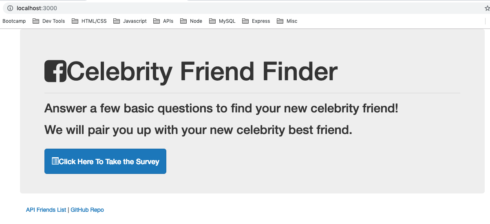
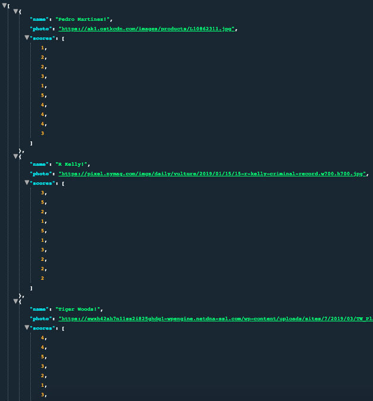
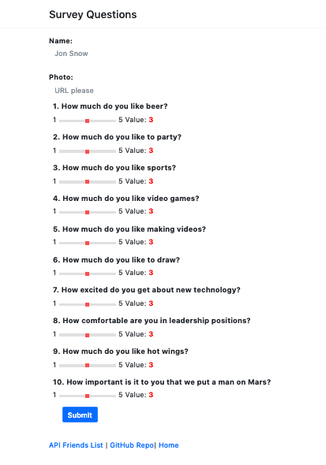

# FriendFinder
Express and Node.js application

# https://fast-plains-42019.herokuapp.com/

## Overview
This is a compatibility-based "FriendFinder" application, that will take in results from user surveys to then find the best match within the database. After completing a survey the app will display the name and picture of your best overall match. 
Express is used to handle the routing. 

### Home page

### JSON formatted raw data

### Survey

### Results

